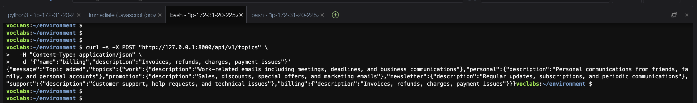
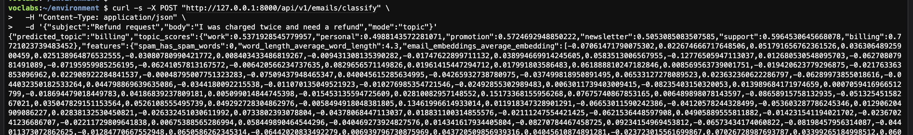
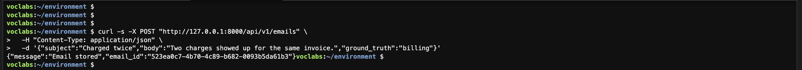
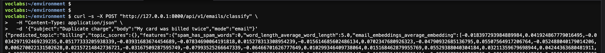

# Lab 2 – Dynamic Topics + Stored Email Similarity Classification

## Overview

This project extends the email topic classification API to support:

- Adding new topics dynamically and persisting them to `data/topic_keywords.json`
- Storing emails with optional ground truth labels in `data/stored_emails.json`
- Dual-mode inference:
  - `mode="topic"`: cosine similarity between email embedding and topic embeddings
  - `mode="email"`: cosine similarity between email embedding and stored email embeddings (nearest neighbor)

## Changes Implemented

### 1) `POST /api/v1/topics`

Adds or updates a topic and persists it to the topics file.

### 2) `POST /api/v1/emails`

Stores an email with optional `ground_truth`. The system stores the embedding so retrieval-based inference is fast.

### 3) `POST /api/v1/emails/classify` (mode switch)

- `mode="topic"` uses the topic similarity classifier
- `mode="email"` predicts using the most similar stored email’s ground truth

## Demonstration (Screenshots)

### A) Add a New Topic (billing)

### B) Classify Using New Topic (topic mode)

### C) Store Email With Ground Truth

### D) Classify Using Stored Emails (email mode)

## Notes

- Topics are stored under `/api/v1/topics`
- Emails are stored under `/api/v1/emails`
- Classification supports both topic-based and retrieval-based inference via the `mode` field